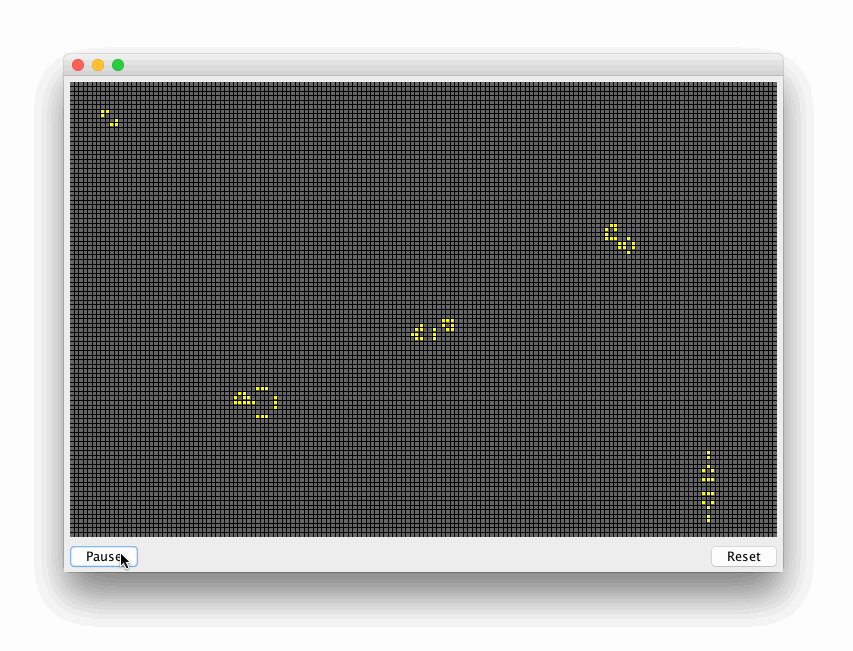

# Game of Life!
[Game of Life](https://en.wikipedia.org/wiki/Conway%27s_Game_of_Life) is a mathematical model (more precisely, a [cellular automaton](https://en.wikipedia.org/wiki/Cellular_automaton)) devised by mathematician [John Conway](https://en.wikipedia.org/wiki/John_Horton_Conway) in 1970. I created this applet using Java's AWT and Swing frameworks, while going through [this YouTube tutorial](http://www.youtube.com/watch?v=9p9IMB7-kZg).

Demo GIF: (may take some time to load; be patient!)

To build, just clone this repository and open it in an IDE like NetBeans or Eclipse and simply run the project (click the "play" button). Otherwise, compile it on the command line and run the corresponding build for [GOL.java](src/gol/GOL.java).
